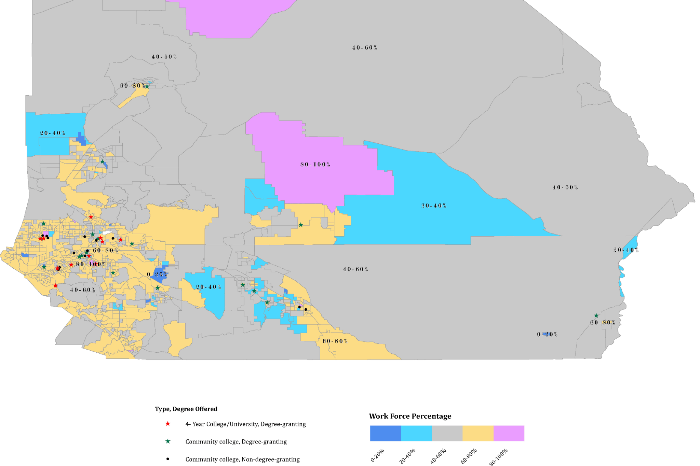

**Coachella/Morongo Basin SRT Meeting and Reviewer Group Notes**  
May 8 and \~May 24, 2024

## **OVERVIEW:**

The Coachella/Morongo Basin SRT Hybrid Meeting on May 8th consisted of 14 attendees and 4 SRT leads and support teams. The attendees came from various locations, including Beaumont, Joshua Tree, Riverside, Beaumont, Moreno Valley, Palm Desert, Pioneertown, and Yucca Valley. Both attendees and SRT leads represented different affinity groups: business owners, CBOs, CA Native Americans, labor, workforce, youth, residents, and the disinvested community. The Thrive Coachella/Morongo hosted a May 8, 2024 Subregional Table (SRT) hybrid meeting that included an overview of Catalyst Funding and of the Strategy Review process. Seven (7) reviewers volunteered to review strategy summaries by May 24, 2024\. SRT meeting attendees were introduced to strategy summaries and discussed some of the strategies in the meeting. Attendees self-selected strategies to discuss. Four (4) reviewers submitted direct notes to the Google form. Notes were taken during the meeting and compiled by Carolyn Schutten. This report serves to summarize their valuable feedback on Thrive Inland Socal draft strategy summaries. 

## **KEY TAKEAWAYS:**

* **Advanced manufacturing** \- The subregion needs to attract large employers to the area and needs more tech advancement opportunities, as there are training programs in place but no local jobs to support workers once trained. In previous SRT meetings, attendees expressed an interest in the mineral industry, hydrogen, affordable prefab manufacturing, and EV car, charging, and/or battery manufacturing. Robotics and autonomous systems might also be integrated to expedite production and bring in new industries for infrastructure and increased output. Map existing manufacturing units and use the information to highlight gaps. Additionally, tourism is a vital industry in the region and, as such, needs cohesive strategies of its own.   
* **Business services** \- Create a training pipeline for youth to move multiple layers of business services. Cybersecurity is an emerging area and there is local infrastructure, however, trained cyber workers cannot find jobs in the Inland region; businesses do not have capacity to invest heavily in these services.  
* **Cleantech** \- Our hydrogen supply is small and our infrastructure footprint for the fuel is severely limited; couple industrial transportation with passenger transportation infrastructure to build the necessary support systems to maintain this clean technology.  
  Collaborate with building trades councils and the IBEW locals to expand pre-apprenticeships and apprenticeship opportunities in tribal communities to develop EV charging stations.  
* **Sustainable supply chains** \- Community engagement and education to inform and reduce skepticism over climate change.
* **Access to childcare** \- Identify funding streams and invest in training local childcare providers.
* **Access to the education and training needed for quality jobs** \- Youth should be exposed to potential high quality jobs and skills building/training at a very early age. Use pre-apprenticeship programs like the Northern American National Building Trades (MC-3) program. Create a centralized resource and information hub and support use at the local level. Continue to work with colleges, unions, and trades to establish training pre-apprenticeships, and mentoring programs.  
* **Building cultural and social capital** \- Initiatives and programs should be rooted in building cultural and social capital, including financial literacy, and the expansion of networking opportunities. 
* **Employer-supported workforce housing \-** Unable to fill lower paying jobs, insufficient housing stock, Airbnb market displacing residents, and multiple families living in one home: Partner with tribes to secure housing projects, and work with contractors to support mutual aid programs. (Review checkerboard parcels?)
* **Entrepreneurial ecosystem for high-growth startups and Main Street businesses** \- Diversify and expand significantly entrepreneurship mentoring, training, and programs. Develop satellite locations with existing companies. Develop innovation and entrepreneurship incubators and a “startup studio” to house co-working, meetings, training, and events to promote and mature the ecosystem. Create access by disinvested communities to professionals from key industries to network and build skills. Provide access to specialized mentorship, training, and networking opportunities for cybersecurity and high-growth startups. Initially build with a remote first facility and pool talent to foster learning across disciplines. Offer tailored funding programs and investment opportunities for cybersecurity and high-growth startups, including grants, seed capital, loans, and venture capital. Develop a path for military veterans to transition into cybersecurity by working with non-profit facilities and existing training programs to maintain high-value job skills for the region. See more in “raw notes”. 
* **Pathways to careers in management** \-  Innovate new models for management training.
* **Pathways to quality jobs in construction and related trades** \- Multiple training and apprenticeships exist; area needs more jobs.
* **Pathways to quality jobs in healthcare** \- Expand nursing and healthcare training programs, and open satellite facilities to support local and remote workers and communities.
* **Pathways to quality jobs in IT** \- This subregion needs technological support and growth of tech jobs in general. Provide regional GIS mapping to support interconnections between workers, training, and workers or entrepreneurs. Create a funding and incubator system for tech startups. Some of the technology we can use immediately like mapsol with some funding to fulfill this gap and hire some locals to help implement. The long term play should be to build mid-size companies up (50 to 100 million) in the region and help them sell across the US and internationally to keep talent in Inland SoCal.
* **Technology access** \- Expose youth very early to modern technologies and through afterschool programs. Partner with clean energy providers for a combination of work/play spaces so parents can charge their vehicles while they wait for an after school program.
* **Transportation access** \- Invest in transportation hubs. Support the disinvested community through programs to get drivers licenses. In other SRT meetings, attendees expressed interest in transportation hubs that include food shopping, childcare, incubators, and training centers.

## **GENERAL TAKEAWAYS**

* The community needs support in understanding the economic development process through a variety of engagement practices, including town hall meetings and youth listening sessions. Strategies should be community-led and \-engaged as well as climate friendly. Strategies, initiatives, and programs should include building cultural and social capital.
* Local talent and workers, even well-trained, must travel or move “down the hill” in order to meet the demands of childcare and housing.
* “Intentional” and “purpose-driven” use of technology, specifically regional ecosystem mapping as well as technological support and growth of tech jobs. Utilize GIS platforms to map opportunities and align economic development with UN SDGs. 
* Expose youth to potential high quality jobs and skills building at a very early age.
* Recruitment will be inevitable if we build a world-class ecosystem where employers will want to hire our people. 

## **THEMES:**

Major themes included the need to foster community understanding of the economic development process and meaningful community engagement. For the Coachella/Morongo Basin region, attendees noted that the tourism industry and ecosystem need cohesive strategies in order to foster high quality jobs and entrepreneurship. Additionally, interest in advancing the technology sector was very high. One attendee representing CA Native American tribes in labor commented that there are insufficient jobs awaiting workers once trained, a theme echoed by the group. Many agreed that there were abundant training opportunities but few available jobs. There was consensus around the need to attract large employers to the area, as lack of high quality jobs, increasing housing prices, and transportation continue to drive local talent “down the hill” in search of better opportunities. 

Coachella/Morongo Basin SRT attendees discussed numerous themes while looking over the strategy summaries, including pathways to trades, tech, and healthcare as well as housing, transportation, and childcare. Also featured prominently in the conversation were opportunities to build cultural and social capital, and a robust discussion revolved around the entrepreneurship ecosystem. Attendees advocated for initiatives and programs that are rooted in building cultural and social capital, including financial literacy, training, and mentoring programs and the expansion of networking opportunities across chambers of commerce, Rotary groups, etc. Attendees recommended targeted funding initiatives and building on the expertise of successful fundraisers, such as San Manuel, to provide mentoring and training in grant writing and finding capital. Attendees representing youth, entrepreneurs, and CA Native American tribal community advocated for ample job creation, meeting workers where they are, and developing a centralized resource hub or map. Attendees emphasized the need to better utilize public spaces, the school system, and youth events as a means to engage community input, as an exploratory training mechanism, and to mobilize community. One attendee noted the need to reach youth much sooner in their education to explore diverse career pathways. Building community was a central cross-cutting theme during this meeting. 

Attendees also noted the need to expand regional high quality health jobs, training, and satellite facilities in the desert region, as highly trained health workers, such as nurses, cannot find sufficient opportunities in the region or they prefer to travel “down the hill” for better pay to support local housing and childcare needs. Another cross-cutting theme included the “intentional” and “purpose-driven” use of technology, specifically regional ecosystem mapping as well as technological support and growth of tech jobs. The need for affordable housing emerged consistently, as desert residents face rising housing prices and insufficient housing stock. Attendees also noted the need for more child care facilities and entrepreneurship training around those facilities. Issues around transportation, child care, and housing emerged as key symptoms of insufficient high-quality jobs and diverse sectors in the Coachella/Morongo Basin region.

--------------------------------------

**Coachella/Morongo SRT Meeting Raw Notes**

The following are the raw notes of the in-meeting conversation around strategy review summaries. Raw notes from the [Google form](https://docs.google.com/spreadsheets/d/1uYQCqId0HOXXGcCSSQU7Lk-uG3-sKDRCR-RbGSpseK0/edit?usp=sharing) have been included below.

**Economic development process**

* Community lacks basic knowledge of what economic development is: people don’t talk about good jobs, unions, pensions, benefits, etc.  
* Need education, consensus building support, training  
* Need town hall meetings and youth listening sessions  
* Community-led, climate-friendly – both very important factors  
* My summary comment is to highlight the need for (GIS) mapping out various resources and making it a part of the strategy itself.  
* I strongly urge that we consider UN sustainability goals here. Southern California is seen as the front face of advancement in the world and that doesn't need to remain to Orange County and LA. Especially when IE is planning a lot of grassroots level development initiatives like Thrive, I think it is important to start with UN SDGs.

**PRIORITY TRADABLE INDUSTRY CLUSTER**

*  Tech industry is crucial  
  * Need to train next generation of tech workers  
  * No discussion of cyber security  
* Not many large employers in the area, not enough to make a living wage  
* Not enough employers to keep people living in the area  
* Need high quality jobs to encourage people to stay, live, and thrive  
* What attracts high quality jobs?: healthcare, childcare, new technology  
* Bring in and expand tradable sectors in from other areas  
* Support tourism industry  
  * Foster tourism with higher quality jobs   
  * Tourism has low paying jobs  
  * Tourism workers abandoning the area due to high housing prices  
  * Existing K-12 Cordon Bleu chef program is one model  
* I would like to see tech jobs as one of the sectors. My experience with high school kids says there are a lot tech savvy kids in the area, who are the future workforce.

**Advanced Manufacturing**

* Advanced manufacturing roles may be available but no way to get information to youth in an effective manner. Pathways must integrate at a sooner level.  
* There are areas of workforce development that should be reviewed as it relates to advance manufacturing. Cobotics is an area that can serve as a bridge technology to increase output in the logistics arena. This will create new types of jobs to maintain the robots and repair them as needed. Other robotics and autonomous systems can also be integrated to expedite production and bring in new industries for infrastructure and increased output.  
* It boils down to the recruitment of individuals that are interested in the advancement manufacturing industry  
* I would like to see the strategy include mapping out where existing manufacturing units and using the information to highlight gaps in geographies that do not have sufficient units.    
  * Mapping the workforce helps to help design this initiative. Please see example    
  
  * Geospatial mapping can enhance the environmental impact assessment as well as help tie this work into the UN SDGs

**ECONOMIC MOBILITY & WEALTH BUILDING**

**Business services**

* There is an opportunity within business services to createa training pipeline for youth interested in "hopping" between multiple layers of business services. Though cybersecurity is an emerging area, there are many instances of cyber students unable to get a job within the Inland Empire region. The area is emerging but businesses do not currently have a capacity to invest heavily in these services, thus preventing them from investing in a hire to dedicate to this area.

**Cleantech**

* There are existing innovations and projects that haven't been discussed or recognized within this space. There are plenty of opportunities to leverage existing projects and bring those to life in conjunction with other projects.  
* As it relates to hydrogen, we need to address normal prices for the region as the current price is at 36 dollars per kilo. Our supply is small and our infrastructure footprint for the fuel is severely limited. It would be advantageous to couple industrial transportation with passenger transportation infrastructure to build the necessary support systems to maintain this clean technology.  
* We are currently submitting a California Energy Commission grant: to collaborate with building trades councils and the IBEW locals to expand pre-apprenticeships and apprenticeship opportunities to in tribal communities to develop EV charging stations.  
* This directly related UN SDG \#7

**Sustainable supply chains**

* I believe there is a large amount of skepticism over climate change and should be a topic of discussion.

**Access to childcare** 

* Only current childcare is at the military base, but not everyone has access to that  
* Boys and Girls Club access depends on school and transportation  
* Child care resources not stable  
* There is great opportunity to alleviate childcare issues by combining existing funding streams with funding available from schools. HR departments can also work in tandem to help train childcare workers.  
* It important to apply for the ERICA Grant

**Access to the education and training needed for quality jobs**

* There are plenty of educational resources available. Online platforms have long helped this area. How do we get our communities to utilize these free resources?  
* Using pre-apprenticeship programs like the Nothern American National Building Trades (MC-3) program  
* Drone pilot pathway is a model

**Building cultural and social capital** 

* Public spaces aren’t being used except for during youth sports/events seasons  
* School system has most access to reach community  
* Need to get information about all different training programs from different industries to community  
* Use youth events as mechanism for community input and exploratory training mechanism  
* Need to mobilize community and show the value of community   
* Building cultural and social capital will require a cultural shift.  
* Promoting cultural events like Native American powwows

**Employer-supported workforce housing** 

* Rising housing prices, unable to fill lower paying jobs  
* Not enough places to live  
* Abandoned houses not being kept up in livable conditions  
* Airbnb market is displacing residents  
* Multiple families living in one home – not able to afford individual family housing  
* Tourism workers leave the area due to high housing prices  
* Work with tribes for the land needed for housing projects.  
* Contractors help in mutual help programs

**Entrepreneurial ecosystem for high-growth startups and Main Street businesses** 

* Tailor programs to meet needs of underrepresented entrepreneurs  
* Target funding initiatives  
* Need mentorship programs with mentors from similar backgrounds, training programs that address specific challenges  
* Need financial literacy programs  
* Networking and community engagement  
* Build up and network with Yucca Valley and 29 Palms Chambers of Commerce  
* Network with small businesses, support areas for growth  
* Hire grant writers to expand industry (ex: Yaamava', etc.)  
* Rotary groups as part of networking, fundraising, etc.   
* Develop relationship with other venues, concerts, etc. to use with software to encourage casino visitors  
  * Tourism industry  
  * Purpose-driven connection using technology to support entrepreneurship ecosystem and mapping  
* An ecosystem converging all of these areas is needed.  
* Key Functions: Provide access to specialized mentorship, training, and networking opportunities for cybersecurity and high-growth startups. Invite other startups to build a satellite location that would be suitable for growth in the region. Establish a startup studio to house co-working, meetings, training, and events to promote and mature the ecosystem. This studio will be welcome for all industries including creatives and marketing.  Initially build with a remote first facility and pool talent to foster learning across disciplines. Facilitate connections between startups and potential customers, partners, and investors within the industry. Offer tailored funding programs and investment opportunities for cybersecurity and high-growth startups, including grants, seed capital, loans, and venture capital. Partner with appropriate entities that provide this capital.  Establish collaborative partnerships with local and national cybersecurity companies, research institutions, and government agencies to drive innovation, adoption, and commercialization. Develop a world-class ecosystem by maintaining high industry standards and a robust pipeline of cybersecurity talent through targeted recruitment, skills development, incentives, and career placement initiatives.  Develop a path for military veterans to transition into cybersecurity by working with non-profit facilities and existing training programs to maintain high-value job skills for the region.  Champion regulatory and compliance support to help startups and employees navigate complex industry and state-level requirements. Leverage data analytics and benchmarking to continuously evaluate and improve the performance of the entrepreneurial ecosystem.  Contributions to Focus Areas:    Job Creation: Developing an ecosystem of startups and entrepreneurs will create new innovations and jobs.  Developing satellite locations with existing companies will create new jobs and economic development in the region.  Developing a facility where innovation and entrepreneurship will be at the center will also attract and create jobs.  Upward Mobility:  Developing an ecosystem will enable interested parties from underrepresented groups to have access to professionals from key industries, network, and build their resumes for job growth.  Certain pieces of training for cybersecurity and other industry startups will be open to the public for increased visibility and personal development.  Connecting members within an ecosystem can create mentorship opportunities for people interested in a high-growth career path. Recruitment will be inevitable if we build a world-class ecosystem where employers will want to hire our people. 

**Pathways to careers in management** 

* To create a more representative and culturally competent leadership class, we must shift how we educate and prepare students to assume a management position.

**Pathways to quality jobs in construction and related trades**  

* CA Native American tribal program \- pre-apprenticeship programs lacking in jobs once trained and support with reaching community where they are  
* Trades have education programs but need jobs for workers  
* Getting involved with the Union for training and job development

**Pathways to quality jobs in healthcare** 

* Need to grow existing Copper Mt. College RN nursing program  
* Need to grow the number of nursing jobs in the desert to retain talent   
* Need satellite nursing programs through the region to train nurses  
* Transportation is a barrier; talent “goes down the hill” for quality health jobs  
* Grown or use model from existing Morongo Unified K-12 pharmacy tech and other programs  
* Have Project Labor Agreements in place construction projects

**Pathways to quality jobs in IT**  

* Need whole region ecosystem mapping  
* Need technological support  
* Purpose-driven map resources needed  
* It is has been historically hard to attract industry to the Riverside/ San Bernadino county areas. My suggestion is to create a funding and incubator system to help startups in the region commercialize more rapidly. Some of the technology we can use immediately like mapsol with some funding to fulfill this gap and hire some locals to help implement. The long term play should be to build mid-size companies up (50 to 100 million) in the region and help them sell across the US and internationally. This will spur jobs in the area and keep talent in Southern California. Otherwise students and talent will migrate to other regions.

**Technology access**

* Starting at a young age will be key to expose children to modern technologies. There are afterschool programs like student hires and kids that code that can fill that gap immediately. We can also set up and partner with clean energy providers for a combination of work/ play spaces so parents can charge their vehicles while they wait for an after school program to finish for example.

**Transportation access**

* Transportation as a barrier: no reason to stay living there, job has to be somewhere else (commute or move)  
* Workers must drive “down the hill” to find quality jobs  
* Transportation hub  
* Utilize agencies had help individuals to get their drivers licenses like California Indian Manpower Consortium