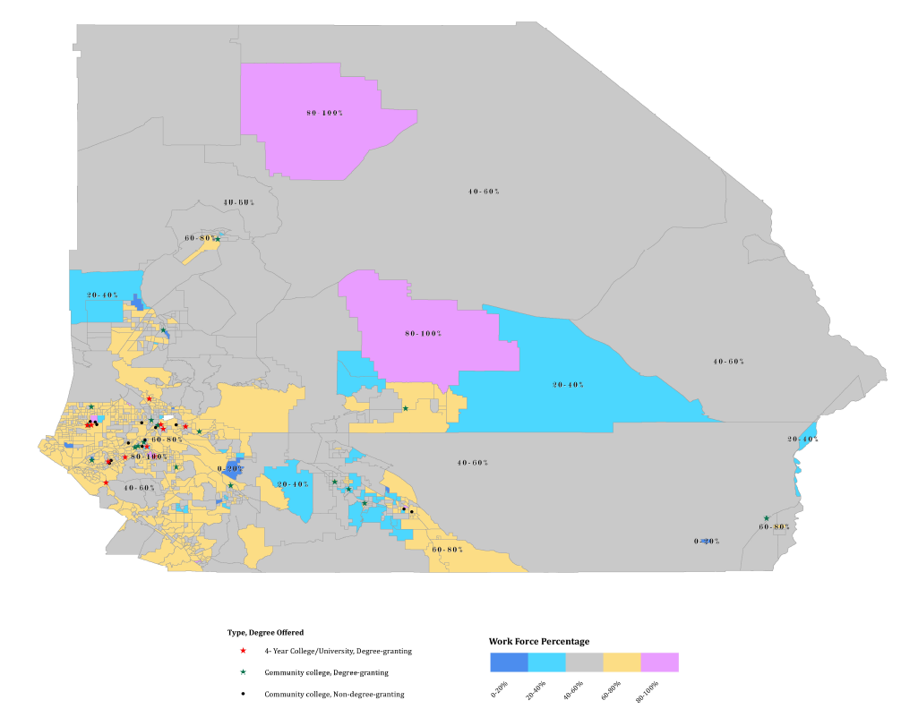

# Southwestern Riverside \- Strategy Feedback Meeting Summary

May 30, 2024

## Discussion Topic

Southwestern Riverside SRT members met on May 21, 2024 to discuss CJF strategy development summaries. 

## Summary of Key Themes

Participants of the strategy feedback review session indicated gaps, issues and needs within the following topic areas:

* Barriers to Employment for Priority Populations  
* Mental Wellness  
* Human Resource Policy/Benefits  
* Mapping  
* Tech Jobs  
* United Nations Sustainable Development Goals  
* Transportation  
* Housing  
* Agriculture

| Key Themes | Notes |
| :---- | :---- |
| Barriers to Employment for Priority Populations | Greater need for addressing barriers to employment for veterans, formerly incarcerated, disabled individuals, etc. Create priority opportunities for these individuals Management and employer training or support needed in working with these populations  |
| Mental Wellness | Reference “mental wellness” as opposed to “mental health” |
| Human Resource Policy/Benefits | Address limited work hours. Employees are barred from working more hours, limiting their ability to access benefits; this leads to people working more than one job at a time Strategy that supports businesses’ ability to offer benefits |
| Mapping | Map existing manufacturing units and highlight gaps Workforce mapping can help design manufacturing training programs Map energy and environmental impact associated with advanced manufacturing Need for resource mapping for community |
| Tech Jobs | Tech jobs are a preferred sector More tech jobs for high school students who will eventually join the workforce |
| United Nations Sustainable Development Goals | Align CJF strategy with UN Sustainable Development Goals; in particular Goal 7 \-  Affordable and Clean Energy |
| Transportation | Increased need for carpooling depots/parking areas Equitable transportation access for those with disabilities Strategy for tying transportation nodes and increasing transportation access alongside sector investment  |
| Housing | Employer-sponsored housing would only be available to employees of large businesses; small to medium-sized businesses do not have the capacity to sponsor housing needs Strategy to support employer-led housing for small to medium-sized businesses |
| Agriculture | No mention of regenerative or sustainable agriculture Strategy for urban food production |

## 

## Raw Notes:

**Reviewer Feedback:**

“In looking over the material I feel like the area we are not addressing is what businesses also need to hire individuals with a barrier or who may need an accommodation to one of the areas pointed out. Maybe create an analysis of what businesses are willing to work with those with barriers (veteran, incarcerated, social economic, disability etc...)

It's more than getting individuals training and providing them access, it has to be about getting them in the door and showing their value, not relying on the resume and or the interview to break that barrier.”

“My only suggestion is to reference mental wellness as opposed to mental health. “

“While the document focuses on programs and workforce needs to improve those less served it disappoints me that there is no mention of Human Resource policies, procedures, and practices.  Specifically, an employee’s 28 work hour ceiling dismisses the employer from offering benefits.  So many in our underserved workforce, whom I call the working poor, are working 2 or more jobs to make ends meet.  Upskilling and reskilling cannot be counted on to address this. “

“My summary comment is to highlight the need for (GIS) mapping out various resources and making it a part of the strategy itself.”

“I would like to see tech jobs as one of the sectors. My experience with high school kids says there are a lot tech savvy kids in the area, who are the future workforce.”

“I strongly urge that we consider UN sustainability goals here. Southern California is seen as the front face of advancement in the world and that doesn't need to remain to Orange County and LA. Especially when IE is planning a lot of grassroots level development initiatives like Thrive, I think it is important to start with UN SDGs.”

“I would like to see the strategy include mapping out where existing manufacturing units and using the information to highlight gaps in geographies that do not have sufficient units.”

“Mapping the workforce helps to help design this initiative.” \- in response to advanced manufacturing training programs

Example provided:

“Geospatial mapping can enhance the environmental impact assessment as well as help tie this work into the UN SDGs” \- in response to energy and environmental impact associated with advanced manufacturing

“This directly related UN SDG \#7” \- in response to Cleantech focus

**SRT Feedback:**

In regards to the transportation section, there was discussion around having more carpooling depots or parking areas, that that is one challenge to carpooling today.

There was also discussion around lack of accessibility, equity, and safety in transportation access particularly for those with disabilities.

In regards to the entrepreneurship section, there was discussion around conducting some special mapping of existing resources so that gaps could be identified.

The employer sponsored housing section seems as though it would only be an option for the very largest employers. Most people in the region work for small to medium-sized businesses that would not have the capacity to take on a sponsored housing project.

In the sustainable supply chain discussion, we noted that there was no mention of agriculture, regenerative ag, or sustainable agriculture. With much of our region home to various agriculture (wine, citrus, avocados etc), it was worth noting. 