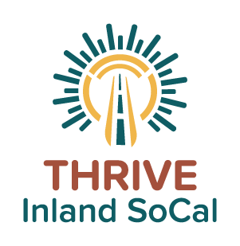

# Thrive Inland SoCal Archive

Thank you for accessing the Thrive Inland SoCal Archive! In this archive, you will find various materials used as part of the [Thrive Inland SoCal](https://www.thriveinlandsocal.org/) project.

Please review the items within the **Contextual Information** folder for information regarding the setup of this archive. The **Final Research Report** folder contains a high-level summary of the regional plan and the draft report sent to the State of California for review. Other folders include materials that contributed to the regional plan.

The materials within this folder have been designated as appropriate to share with the public. For access to items within the larger repository, please reach out to the [Inland Empire Labor Institute](https://ielaborinstitute.org/) at ieli@ielaborinstitute.org.